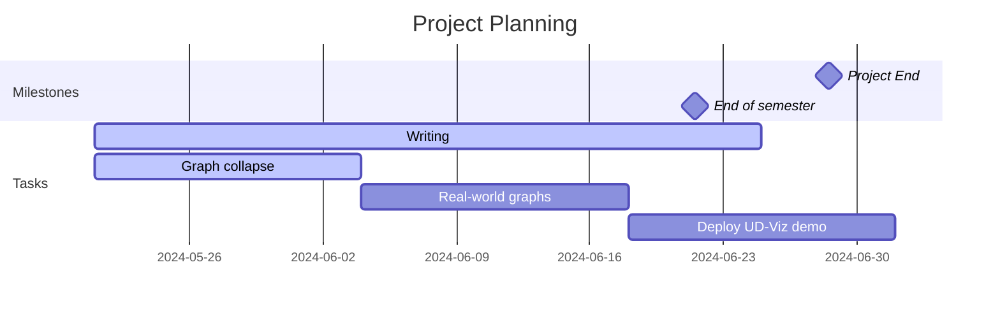
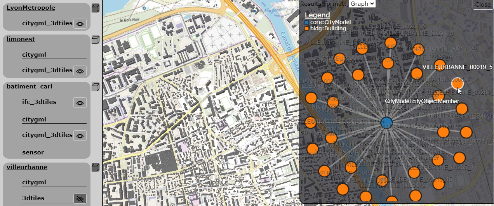
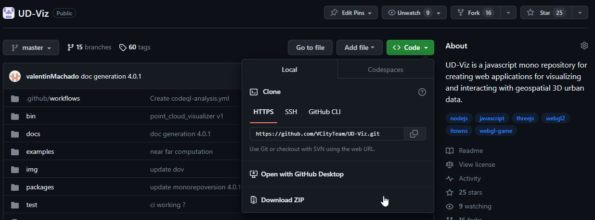
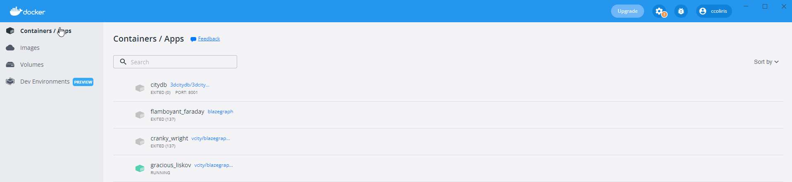
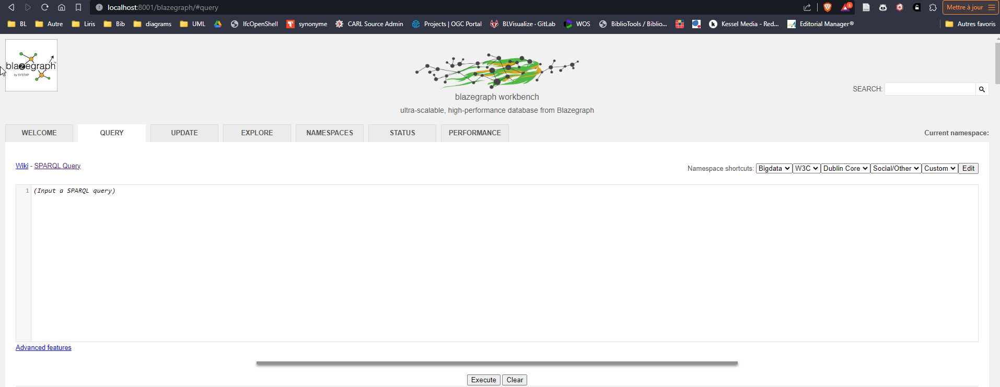
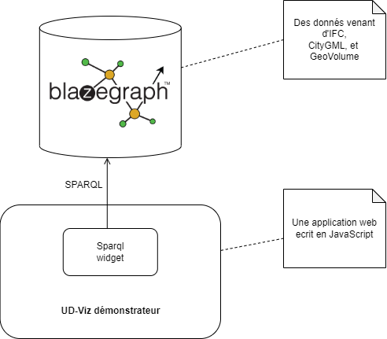
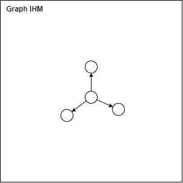
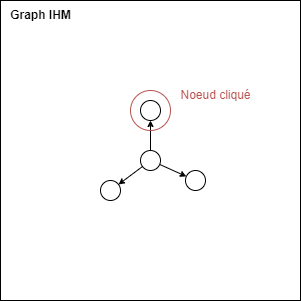
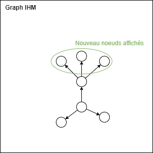

## Projet de recherche Gabriel Rosario Da Silva

### Encadrement :
- Sylvie Servigne
- Diego Vinasco-Alvarez
- Clément Colin




### Contexte

Ce projet de recherche prend place dans les travaux de thèse de Diégo Vinasco-Alvarez (DVA) et Clément Colin (CCO), encadrés par Sylvie Servigne (SSE), au sein du projet VCity du Liris. Le sujet principal du projet est d'étudier l'intégration de données géospatiales urbaines et proposer des solutions pour créer des vues unifiées de données hétérogènes. Ces données sont issues de modèles standardisés différents, ici CityGML et Ifc. Elles sont constitués d'une partie géométrique 3D et d'une partie sémantique. Cette sémantique a été transformée puis stockée sous forme de graphe afin d'homogénéiser leur format, le système de requêtes utilisé et leurs lieux de stockage.    

Ce travail doit permettre de faciliter le visualisation et l'interaction avec les données et de réaliser des scénarios hypothétiques d'utilisateurs.

**L'objectif du projet :** Améliorer le widget de navigation par une IHM dans un graphe de données sémantiques urbaines en permettant à l'utilisateur de naviguer plus facilement dans ces données.




## Tutorial : 

1. UD-Viz :
- https://github.com/VCityTeam/UD-Viz
- Download the project :

- Extract and open it with [Visual Studio Code](https://code.visualstudio.com/)
- Read the file readme.md to get started 
    - Try the online demonstrations
    - Try to install and launch the demonstrations locally
    - Try to understand a bit the architecture and the code of the examples
- More particularly, look at these example :
    - Demo : https://ud-viz.vcityliris.data.alpha.grandlyon.com/examples/SPARQLWidget.html
    - Code : https://github.com/VCityTeam/UD-Viz/blob/master/examples/widget_sparql.html  
- Ask questions !

2. BlazeGraph (datastore):
Available data :
- Doua building : 
    - geovolume : [ttl](./data/collection.ttl)
    - citygml : [ttl](./data/doua_cgml_geomless.ttl)
    - ifc : [ttl](./data/doua_geomless.ttl)
- Install [docker desktop](https://docs.docker.com/engine/install/)
- In the terminal of Visual Studio Code, run the following command : 
```
docker run vcity/blazegraph-cors -p 8001:8080 -t blazegraph
```
- Assert that a line appears in green in docker desktop --> container / apps

- On your browser, go to [localhost:8081/blazegraph](http://localhost:8001/blazegraph/#splash)

- You now add data to your database using the **update tab**

- To show all data, use the following query on the **query tab** 
    ```
    SELECT *
    WHERE {
        ?subject ?predicate ?object
    }
    ```

- Try and browse the data
- Ask questions !

### Environnement technique 

Ce travail doit être effectué en amont du widget sparql, écrit en [JavaScript](https://en.wikipedia.org/wiki/JavaScript) ([voir tutoriel](https://www.w3schools.com/js/default.asp)), qui effectue des requêtes sur la base de donnée graphe BlazeGraph. Ce base contient des données IFC, CityGML et GeoVolume sous forme de graphe [RDF](https://en.wikipedia.org/wiki/Resource_Description_Framework) ([voir tutoriel](https://www.linkeddatatools.com/introducing-rdf/)).

Outils nécessaire :
- Editeur de code ([VSCode](https://code.visualstudio.com/))
- [NPM](https://www.npmjs.com/package/npm)
- [Docker](https://docs.docker.com/engine/install/)


Architecture technique du démonstrateur :



### Exemple de résultats attendus

Scénario utilisateur basique : 
1. Depuis l'interface, l'utilisateur requête l'ensemble des représentations RDF disponible pour le batiment de la doua. Un graphe s'affiche
   - 
2. Après interaction avec un noeud...
   - 
3. l'ensemble de noeud fils sont requêtés puis affichés.
   - 
4. Rapport (see email from Sylvie Servigne)
5. Presentation
   1. 10-15 minutes of slides
      1. Introduction/context
      2. Problem
      3. Current progress
      4. 5 minute demonstration
      5. Future work/next steps
   2. Questions

Implementation des filtres sur le graphe :
- Type de liens
- Type de noeud
